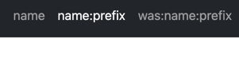
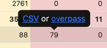

# OSM Name Migrate

## Binary Dependencies

    apt install osmctools

## Belarus OSM links detection

[belarus-osm-links.ipynb](belarus-osm-links.md)

## Belarus OSM `name`, `name:be`, `name:ru` tags statistic per category

[belarus-osm-name-statistic.ipynb](belarus-osm-name-statistic.md)

## Belarus OSM full language tag statistic per category

[index.html](https://tbicr.github.io/osm-name-migrate/)

Report contains information about different language tags as `name`, `name:prefix`, `short_name` and etc:

Report contains progress and statistic reports, `name` also contains dependants tags as `addr:street`, `destination` and etc. progress and statistic report.

In progress report popup can provide more information follow `CSV` or `overpass` links:

To create report run:

    docker-compose run --rm management python belarus_report.py

## Belarus migrate script

    python belarus_upd.py

Script contain two parts:
- language tag (as `name`) migration for elements that has `tag`, `tag:be` and `tag:ru` tags - in this case just copy `name:be` to `name`
  - example: way1 has tags `name=улица Скарыны`, `name:be=вуліца Скарыны`, `name:ru=улица Скарыны`, set way1 `name` to way1 `name:be` value: `name=вуліца Скарыны`
- `name` dependant (as `add:street`) migration - find nearest element with `name`, `name:be` and `name:ru` tags where dependant tag in this tags and copy `name:be` to dependant tag
  - example: node1 has tag `addr:street=улица Скарыны`, find nearest element way1 with tags `name=вуліца Скарыны`, `name:be=вуліца Скарыны`, `name:ru=улица Скарыны`, set node1 `addr:street` to way1 `name:be` value: `addr:street=вуліца Скарыны`
